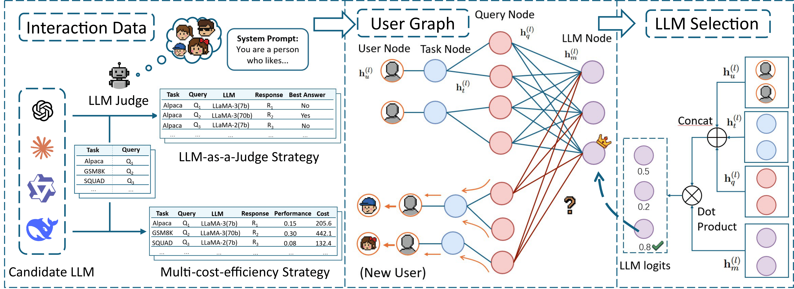

# PersonalizedRouter: A Personalized LLM Router Based on User Preferences

<p align="center">
    <a href="https://ulab-uiuc.github.io/PersonalizedRouter/">
        
    </a>
</p>

<p align="center">
    <a href="https://ulab-uiuc.github.io/PersonalizedRouter/">🌐 Project Page</a> |
<p>

<!--  -->

<div align="center">
  
</div>


## 🛠️Preliminary


### Environment Setup

```shell
# create a new conda environment
conda create -n personalizedrouter python=3.10
conda activate personalizedrouter

# install pytorch. Modify the command to align with your own CUDA version.
pip3 install torch  --index-url https://download.pytorch.org/whl/cu118

# install related libraries
pip install -r requirements.txt

# install pyg
pip install torch_geometric
pip install pyg_lib torch_scatter torch_sparse torch_cluster torch_spline_conv -f https://data.pyg.org/whl/torch-2.1.0+cu118.html

```
### Notation
In the project files, the suffix `v1` refers to the `Multi-cost-efficiency Simulation Strategy` described in the paper, while `v2` refers to the `LLM-as-a-Judge Strategy`.

### Dataset Preparation 

First, generate `data/unified_qa_data.csv`.

```bash
python data_processing/multidata_unify.py
```
Then, generate `data/router_data_v1(v2).csv` and `configs/llm_description_embedding_v1(v2).pkl` by setting your api_key in `configs/config.yaml`.

```bash
python data_processing/construct_router_data.py
```

For the LLM-as-a-Judge setting, generate `llm_judge_results.csv`

```bash
python data_processing/construct_llm_judge.py
```

In addition, we need to introduce user nodes to generate `router_user_data_v1(v2).csv` 

```bash
python data_processing/add_user_data_v1.py

or

python data_processing/add_user_data_v2.py
```

For your convenience, we have provided the pre-generated files in the `data` folder, including all the files mentioned above.

## 📝Experiments


### Training and Evaluation

Run experiments and print/save evaluation results on metrics Performance, Cost, and Reward. You can edit the hyperparameters in `configs/config.yaml` or using your own config_file.


```bash
python run_exp.py --config_file [config]
```
